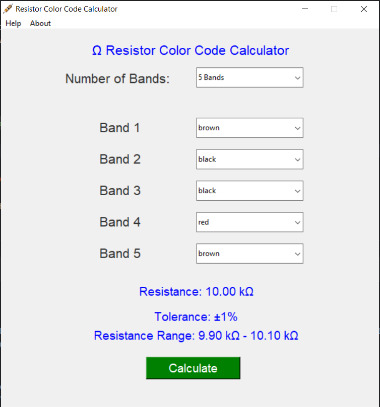

# Resistance Calculator for 4 and 5 Band Color Codes

 >A python resistor calculator for 4 and 5 band resistor color codes. The GUI allows users to interactively select the colors of the resistor bands through comboboxes. Each band's color selection corresponds to a specific numerical value and tolerance, defined in the color_codes dictionary.  Upon selecting the band colors, the code triggers the calculate_resistance() function, which performs the necessary calculations to determine the resistance value based on the color codes. Additionally, depending on the chosen notation (4-band or 5-band), the function calculates the tolerance value accordingly.
