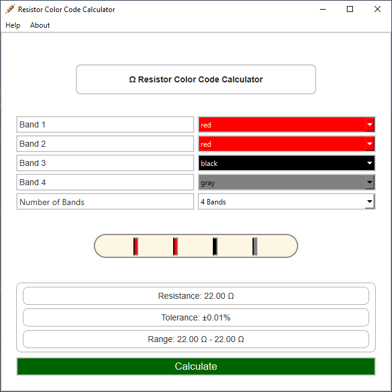

# Resistance Calculator for 4, 5, and 6 Band Color Codes

 >A Python resistor calculator for 4, 5, and 6 band resistor color codes. The GUI allows users to interactively select the colors of the resistor bands through comboboxes. Each band's color selection corresponds to a specific numerical value and tolerance, defined in the color_codes dictionary.  Upon selecting the band colors, the code triggers the calculate_resistance() function, which performs the necessary calculations to determine the resistance value based on the color codes. Additionally, depending on the chosen notation (4-band or 5-band), the function calculates the tolerance value accordingly.

## CHANGELOG 
 - Major version update: Version incremented (from v1.0 to v2.0)
 - Added support for 6-band resistor calculations including temperature coefficient.
 - Migrated GUI from Tkinter to PyQt6 framework to enhance user interface appearance and functionality.
 - Minor bug fixes and appearance/performance tweaks.
 - Rebuilt Windows binary with updated PyQt6 GUI and features.
 - The Linux binary remains at the previous version and will not be included in the upcoming release to shift the focus to Windows functionality.

## Description
The Resistor Calculator is a GUI application developed in Python using the PyQt6 framework. It enables users to calculate the resistance, tolerance, and temperature coefficient (for 6-band resistors) of resistors based on their color bands. The application supports 4-band, 5-band, and 6-band resistor types.

## Features
 - Select the number of bands (4, 5, or 6).
 - Choose colors corresponding to each resistor band.
 - Calculate resistance value and tolerance.
 - Display resistance range based on tolerance.
 - Display temperature coefficient for 6-band resistors.

## Dependencies
- Python 3.8 or newer
- PyQT6 framework (pip install pyqt6)

## Installation

### Clone
1. **Clone the Repository**:
   ```bash
   git clone https://github.com/kaotickj/Resistance-Calculator-for-4-and-5-Band-Color-Codes.git
   cd Resistance-Calculator-for-4-and-5-Band-Color-Codes
   ```

2. **Ensure Python is Installed**:
   Make sure you have Python 3.x installed on your system. You can download it from [python.org](https://www.python.org/downloads/).

3. **Run the setup script using Python**:
   `python setup.py`
   
   **OR - install with pip**
   `pip instal -r requirements.txt`
   
### Manual Download

1. **Download the Repository:**
   - Go to the [Resistance-Calculator-for-4-and-5-Band-Color-Codes](https://github.com/kaotickj/Resistance-Calculator-for-4-and-5-Band-Color-Codes) GitHub page.
   - Click on the "<> Code" button.
   - Select "Download ZIP" from the dropdown menu.
   - Save the ZIP file to your preferred location on your computer.

2. **Extract the ZIP File:**
   - Navigate to the location where you downloaded the ZIP file.
   - Right-click on the ZIP file and select "Extract All" (or a similar option depending on your operating system).
   - Choose a destination folder and extract the contents.

3. **Navigate to the Project Directory:**
   - Open your terminal or command prompt.
   - Use the `cd` command to navigate to the extracted project directory. For example:
     ```bash
     cd path/to/Resistance-Calculator-for-4-and-5-Band-Color-Codes
     ```

4. **Run the Application:**

	#### Run the script using python:
   - Execute the following command to start the application:
     ```bash
     python resistanceCalculator.py
     ```
	#### or Run the W;ndows executable:
	`resistamceCalculator.exe`
## Usage Instructions

1. Select the number of bands on your resistor (4, 5, or 6).

### For 4-Band Resistors:

* Band 1: First significant figure
* Band 2: Second significant figure
* Band 3: Multiplier
* Band 4: Tolerance

### For 5-Band Resistors:

* Band 1: First significant figure
* Band 2: Second significant figure
* Band 3: Third significant figure
* Band 4: Multiplier
* Band 5: Tolerance

### For 6-Band Resistors:

* Band 1: First significant figure
* Band 2: Second significant figure
* Band 3: Third significant figure
* Band 4: Multiplier
* Band 5: Tolerance
* Band 6: Temperature coefficient (ppm/°C)

2. Select the corresponding color for each band from the dropdown menus.
3. Click the **Calculate** button to view resistance, tolerance, range, and temperature coefficient (if applicable).

---

## How to Determine the First Color Band

* The first band is usually closer to one end of the resistor.
* The tolerance band (gold, silver, or none) is typically separated by more space and located on the far right.
* Hold the resistor so the tolerance band is on the right; the first color band is then on the far left.
* For 5 and 6-band resistors, the first three bands represent significant figures; the subsequent bands are multiplier, tolerance, and optionally temperature coefficient.

---

## Use Case Information

Ideal for electronics enthusiasts, students, and professionals needing quick, accurate resistor value calculations based on color codes. Also useful in educational settings for learning resistor identification and tolerance interpretation.

---

## About

Developed by **Kaotick Jay**
GitHub: [https://github.com/kaotickj](https://github.com/kaotickj)
Website: [https://kdgwebsolutions.com](https://kdgwebsolutions.com)

## License
This project is licensed under the MIT License - see the [LICENSE](LICENSE) file for details.
